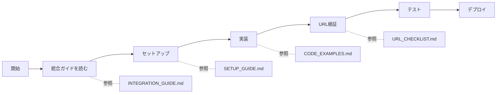

# ビジネスLPメーカー ドキュメント索引

## 📚 ドキュメント一覧

このディレクトリには、プロフィールLPメーカーをベースにビジネスLPメーカーを構築するための包括的なドキュメントが含まれています。

---

## 🎯 目的別ガイド

### 初めて読む方

1. **[BUSINESS_LP_INTEGRATION_GUIDE.md](BUSINESS_LP_INTEGRATION_GUIDE.md)** ⭐ 必読
   - プロジェクト全体の統合ガイド
   - データベース設計、ルーティング、共通コンポーネントの活用方法
   - よくあるバグと対策
   - 実装フローチャート

### 実装中の方

2. **[BUSINESS_LP_CODE_EXAMPLES.md](BUSINESS_LP_CODE_EXAMPLES.md)** 💻 実装時に参照
   - Server Actions、API Routes、トラッキングコンポーネントのコード例
   - データベースクエリの具体例
   - 検索パターン集

3. **[BUSINESS_LP_URL_CHECKLIST.md](BUSINESS_LP_URL_CHECKLIST.md)** ✅ 実装前後に確認
   - URL検証チェックリスト
   - よくある間違いと修正方法
   - 自動検証スクリプト

### 既存のドキュメント

4. **[BUSINESS_LP_SETUP_GUIDE.md](BUSINESS_LP_SETUP_GUIDE.md)** 🚀 セットアップ手順
   - データベースセットアップ
   - 環境変数の設定
   - ルーティング構成

5. **[PROJECT_SPECIFICATION.md](PROJECT_SPECIFICATION.md)** 📖 プロジェクト仕様書
   - プロフィールLPメーカーの全体仕様
   - 技術スタック、機能一覧、データベース設計

---

## 📋 ドキュメント詳細

### 1. BUSINESS_LP_INTEGRATION_GUIDE.md

**対象者**: すべての開発者（必読）

**内容**:
- プロジェクト構造の理解
- データベース設計（テーブル対応表）
- ルーティング戦略（URL構造の対応表）
- 共通コンポーネントの活用
- Server Actionsの活用
- 決済処理の実装
- アナリティクスの実装
- よくあるバグと対策
- コード検索・置換チェックリスト
- 実装フローチャート

**特徴**:
- 包括的な統合ガイド
- 実践的なコード例
- チェックリスト形式
- Mermaidダイアグラムで視覚化

**読むべきタイミング**: 実装開始前に必ず読む

---

### 2. BUSINESS_LP_CODE_EXAMPLES.md

**対象者**: 実装中の開発者

**内容**:
- Server Actions（business.ts、analytics.ts）
- API Routes（business-checkout、business-verify、business-delete）
- トラッキングコンポーネント（BusinessViewTracker.tsx）
- ページコンポーネント（公開ページ、ダッシュボード）
- データベースクエリ
- 検索パターン集

**特徴**:
- すぐに使えるコード例
- コピー&ペースト可能
- コメント付きで説明

**読むべきタイミング**: 実装中に参照

---

### 3. BUSINESS_LP_URL_CHECKLIST.md

**対象者**: 実装前後の開発者

**内容**:
- 実装前チェックリスト
  - 公開ページのURL
  - ダッシュボードのURL
  - エディタのURL
  - チラシ印刷のURL
  - API エンドポイントのURL
  - 決済後のリダイレクトURL
  - クエリパラメータの処理
- 実装後検証チェックリスト
  - 手動テスト項目
- デバッグ方法
- よくある間違いと修正方法
- 自動検証スクリプト（PowerShell）

**特徴**:
- チェックボックス形式
- 具体的な確認コマンド
- 自動検証スクリプト付き

**読むべきタイミング**: 実装前と実装後

---

### 4. BUSINESS_LP_SETUP_GUIDE.md

**対象者**: 初期セットアップを行う開発者

**内容**:
- 概要
- 主な機能
- セットアップ手順
- ルーティング構成
- データベーステーブル
- API エンドポイント
- チラシ印刷機能の使い方
- トラブルシューティング
- プロフィールLPとの違い

**特徴**:
- ステップバイステップの手順
- トラブルシューティング付き

**読むべきタイミング**: 初期セットアップ時

---

### 5. PROJECT_SPECIFICATION.md

**対象者**: プロジェクト全体を理解したい開発者

**内容**:
- プロジェクト概要
- 技術スタック
- システム構成
- 機能一覧
- データベース設計
- ブロックシステム
- 決済システム
- アナリティクス機能
- セキュリティ
- 環境変数

**特徴**:
- プロフィールLPメーカーの全体仕様
- 詳細な技術情報

**読むべきタイミング**: プロジェクト全体を理解したいとき

---

## 🔄 実装フロー



### 推奨される読む順序

1. **[BUSINESS_LP_INTEGRATION_GUIDE.md](BUSINESS_LP_INTEGRATION_GUIDE.md)** - 全体像を理解
2. **[BUSINESS_LP_SETUP_GUIDE.md](BUSINESS_LP_SETUP_GUIDE.md)** - 初期セットアップ
3. **[BUSINESS_LP_CODE_EXAMPLES.md](BUSINESS_LP_CODE_EXAMPLES.md)** - 実装時に参照
4. **[BUSINESS_LP_URL_CHECKLIST.md](BUSINESS_LP_URL_CHECKLIST.md)** - 実装前後に確認

---

## 🎯 シナリオ別ガイド

### シナリオ1: 新規にビジネスLPメーカーを構築する

1. [BUSINESS_LP_INTEGRATION_GUIDE.md](BUSINESS_LP_INTEGRATION_GUIDE.md) を読んで全体像を理解
2. [BUSINESS_LP_SETUP_GUIDE.md](BUSINESS_LP_SETUP_GUIDE.md) に従ってセットアップ
3. [BUSINESS_LP_CODE_EXAMPLES.md](BUSINESS_LP_CODE_EXAMPLES.md) を参考に実装
4. [BUSINESS_LP_URL_CHECKLIST.md](BUSINESS_LP_URL_CHECKLIST.md) でURL検証

### シナリオ2: プロフィールLPのコードをビジネスLP用に修正する

1. [BUSINESS_LP_INTEGRATION_GUIDE.md](BUSINESS_LP_INTEGRATION_GUIDE.md) の「よくあるバグと対策」を読む
2. [BUSINESS_LP_URL_CHECKLIST.md](BUSINESS_LP_URL_CHECKLIST.md) の自動検証スクリプトを実行
3. [BUSINESS_LP_CODE_EXAMPLES.md](BUSINESS_LP_CODE_EXAMPLES.md) の検索パターン集で問題箇所を特定
4. [BUSINESS_LP_INTEGRATION_GUIDE.md](BUSINESS_LP_INTEGRATION_GUIDE.md) の「コード検索・置換チェックリスト」で修正

### シナリオ3: URLリンクの間違いを修正する

1. [BUSINESS_LP_URL_CHECKLIST.md](BUSINESS_LP_URL_CHECKLIST.md) の自動検証スクリプトを実行
2. 問題箇所を特定
3. [BUSINESS_LP_INTEGRATION_GUIDE.md](BUSINESS_LP_INTEGRATION_GUIDE.md) の「ルーティング戦略」を参照して修正
4. [BUSINESS_LP_URL_CHECKLIST.md](BUSINESS_LP_URL_CHECKLIST.md) の手動テストで確認

### シナリオ4: アナリティクスや決済処理を実装する

1. [BUSINESS_LP_INTEGRATION_GUIDE.md](BUSINESS_LP_INTEGRATION_GUIDE.md) の該当セクションを読む
2. [BUSINESS_LP_CODE_EXAMPLES.md](BUSINESS_LP_CODE_EXAMPLES.md) のコード例を参考に実装
3. `content_type='business'` の設定を忘れずに
4. テーブル名を `business_projects`、`business_project_purchases` に変更

---

## 🔍 キーワード検索

### データベース関連
- テーブル名: [BUSINESS_LP_INTEGRATION_GUIDE.md](BUSINESS_LP_INTEGRATION_GUIDE.md) - データベース設計
- クエリ例: [BUSINESS_LP_CODE_EXAMPLES.md](BUSINESS_LP_CODE_EXAMPLES.md) - データベースクエリ

### URL・ルーティング関連
- URL構造: [BUSINESS_LP_INTEGRATION_GUIDE.md](BUSINESS_LP_INTEGRATION_GUIDE.md) - ルーティング戦略
- URL検証: [BUSINESS_LP_URL_CHECKLIST.md](BUSINESS_LP_URL_CHECKLIST.md)

### アナリティクス関連
- 実装方法: [BUSINESS_LP_INTEGRATION_GUIDE.md](BUSINESS_LP_INTEGRATION_GUIDE.md) - アナリティクスの実装
- コード例: [BUSINESS_LP_CODE_EXAMPLES.md](BUSINESS_LP_CODE_EXAMPLES.md) - トラッキングコンポーネント

### 決済処理関連
- 実装方法: [BUSINESS_LP_INTEGRATION_GUIDE.md](BUSINESS_LP_INTEGRATION_GUIDE.md) - 決済処理の実装
- コード例: [BUSINESS_LP_CODE_EXAMPLES.md](BUSINESS_LP_CODE_EXAMPLES.md) - API Routes

### 共通コンポーネント関連
- 活用方法: [BUSINESS_LP_INTEGRATION_GUIDE.md](BUSINESS_LP_INTEGRATION_GUIDE.md) - 共通コンポーネントの活用
- コード例: [BUSINESS_LP_CODE_EXAMPLES.md](BUSINESS_LP_CODE_EXAMPLES.md) - トラッキングコンポーネント

---

## ⚠️ 重要な注意事項

### 必ず確認すること

1. **テーブル名の変更**
   - `profiles` → `business_projects`
   - `profile_purchases` → `business_project_purchases`

2. **content_type の設定**
   - アナリティクス保存時: `content_type='business'`
   - アナリティクス取得時: `.eq('content_type', 'business')`

3. **URL・パスの変更**
   - `/p/` → `/b/`
   - `/dashboard` → `/business/dashboard`
   - `page=dashboard` → `page=business-dashboard`

4. **API エンドポイントの変更**
   - `/api/checkout-profile` → `/api/business-checkout`
   - `/api/verify-profile` → `/api/business-verify`

### よくある間違い

- ハードコードされた `/p/` や `/dashboard` をそのまま使う
- `content_type` の設定を忘れる
- テーブル名を `profiles` のまま使う
- 決済後のリダイレクトURLが間違っている

詳細は [BUSINESS_LP_INTEGRATION_GUIDE.md](BUSINESS_LP_INTEGRATION_GUIDE.md) の「よくあるバグと対策」を参照してください。

---

## 🛠️ ツール・スクリプト

### 自動検証スクリプト

[BUSINESS_LP_URL_CHECKLIST.md](BUSINESS_LP_URL_CHECKLIST.md) に含まれるPowerShellスクリプトを使用して、URLリンクの間違いを自動検出できます。

```powershell
# check-urls.ps1
.\check-urls.ps1
```

### 一括置換スクリプト

[BUSINESS_LP_INTEGRATION_GUIDE.md](BUSINESS_LP_INTEGRATION_GUIDE.md) の「コード検索・置換チェックリスト」に含まれるPowerShellスクリプトを使用して、一括置換できます。

**注意**: 必ずGitでコミットしてから実行してください。

---

## 📞 サポート

### 問題が発生した場合

1. [BUSINESS_LP_INTEGRATION_GUIDE.md](BUSINESS_LP_INTEGRATION_GUIDE.md) の「よくあるバグと対策」を確認
2. [BUSINESS_LP_URL_CHECKLIST.md](BUSINESS_LP_URL_CHECKLIST.md) の「デバッグ方法」を試す
3. [BUSINESS_LP_CODE_EXAMPLES.md](BUSINESS_LP_CODE_EXAMPLES.md) の「検索パターン集」で問題箇所を特定

### ドキュメントの更新

このドキュメントは随時更新されます。最新版を確認してください。

---

## 📝 ドキュメント管理

### バージョン履歴

- **v1.0.0** (2024-12-18)
  - 初版リリース
  - BUSINESS_LP_INTEGRATION_GUIDE.md 作成
  - BUSINESS_LP_CODE_EXAMPLES.md 作成
  - BUSINESS_LP_URL_CHECKLIST.md 作成
  - BUSINESS_LP_DOCS_INDEX.md 作成

### 貢献

ドキュメントの改善提案や誤りの報告は、プロジェクトの開発者に連絡してください。

---

## 🎓 学習パス

### 初心者向け

1. [PROJECT_SPECIFICATION.md](PROJECT_SPECIFICATION.md) でプロフィールLPメーカーの基礎を理解
2. [BUSINESS_LP_INTEGRATION_GUIDE.md](BUSINESS_LP_INTEGRATION_GUIDE.md) でビジネスLPとの違いを理解
3. [BUSINESS_LP_SETUP_GUIDE.md](BUSINESS_LP_SETUP_GUIDE.md) でセットアップ

### 中級者向け

1. [BUSINESS_LP_INTEGRATION_GUIDE.md](BUSINESS_LP_INTEGRATION_GUIDE.md) の全セクションを読む
2. [BUSINESS_LP_CODE_EXAMPLES.md](BUSINESS_LP_CODE_EXAMPLES.md) でコード例を学ぶ
3. 実装を開始

### 上級者向け

1. [BUSINESS_LP_CODE_EXAMPLES.md](BUSINESS_LP_CODE_EXAMPLES.md) を参照しながら実装
2. [BUSINESS_LP_URL_CHECKLIST.md](BUSINESS_LP_URL_CHECKLIST.md) で検証
3. 独自の機能を追加

---

**最終更新日**: 2024年12月18日

**バージョン**: 1.0.0

**作成者**: AI Assistant

