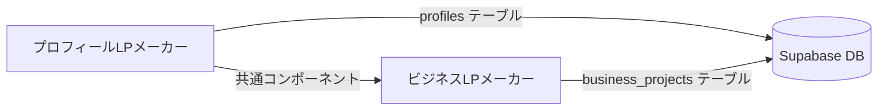

# ビジネスLPメーカー統合ガイド

## 📋 目次

1. [はじめに](#はじめに)
2. [プロジェクト構造の理解](#プロジェクト構造の理解)
3. [データベース設計](#データベース設計)
4. [ルーティング戦略](#ルーティング戦略)
5. [共通コンポーネントの活用](#共通コンポーネントの活用)
6. [Server Actionsの活用](#server-actionsの活用)
7. [決済処理の実装](#決済処理の実装)
8. [アナリティクスの実装](#アナリティクスの実装)
9. [よくあるバグと対策](#よくあるバグと対策)
10. [コード検索・置換チェックリスト](#コード検索置換チェックリスト)
11. [実装フローチャート](#実装フローチャート)

---

## はじめに

このガイドは、**プロフィールLPメーカー**をベースに**ビジネスLPメーカー**を構築する際の統合ガイドです。

### 背景

- ビジネスLPメーカーはプロフィールLPメーカーをフォルダごとコピーして作成
- 同じSupabase DBを使用（テーブルは分離）
- Vercelでは別リポジトリとしてデプロイ
- URLリンクの間違いが多発している課題がある

### このガイドの目的

1. **共通部分を効率的に活用**：重複コードを減らし、メンテナンス性を向上
2. **バグを防止**：URLリンク間違いやDB混在を防ぐ
3. **実装スピード向上**：既存コードを正しく再利用

---

## プロジェクト構造の理解

### 2つのプロジェクトの関係性



### ディレクトリマッピング表

| 機能 | プロフィールLP | ビジネスLP | 備考 |
|-----|-------------|-----------|------|
| **公開ページ** | `app/p/[slug]/page.tsx` | `app/b/[slug]/page.tsx` | URLパス変更 |
| **ダッシュボード** | `app/dashboard/page.tsx` | `app/business/dashboard/page.tsx` | パス変更 |
| **エディタ（新規）** | `app/dashboard/editor/new/page.tsx` | `app/business/dashboard/editor/new/page.tsx` | パス変更 |
| **エディタ（編集）** | `app/dashboard/editor/[slug]/page.tsx` | `app/business/dashboard/editor/[slug]/page.tsx` | パス変更 |
| **チラシ印刷** | なし | `app/b/[slug]/flyer/page.tsx` | ビジネスLP専用 |
| **決済API** | `app/api/checkout-profile/` | `app/api/business-checkout/` | API名変更 |
| **検証API** | `app/api/verify-profile/` | `app/api/business-verify/` | API名変更 |
| **削除API** | `app/api/delete-profile/` | `app/api/business-delete/` | API名変更 |
| **AI生成API** | `app/api/generate-profile/` | `app/api/business-generate/` | API名変更 |

### 共通部分と差異

#### 完全に共通（そのまま使える）

- 認証システム（Supabase Auth）
- 画像アップロード機能
- 基本的なUIコンポーネント（Header, Footer, AuthModal）
- アナリティクスの仕組み（`content_type`で区別）
- 決済の仕組み（テーブルを分ける）

#### カスタマイズが必要

- エディタコンポーネント（レイアウトが異なる）
- ダッシュボードコンポーネント（テーブル名が異なる）
- ブロックレンダラー（ビジネスLP用のブロックタイプ）
- Server Actions（テーブル名が異なる）

---

## データベース設計

### テーブル対応表

| プロフィールLP | ビジネスLP | 用途 |
|-------------|-----------|------|
| `profiles` | `business_projects` | コンテンツデータ |
| `profile_purchases` | `business_project_purchases` | 購入履歴 |
| `analytics` (content_type='profile') | `analytics` (content_type='business') | アクセス解析 |
| `leads` | `leads` | リード収集（共通） |

### profiles vs business_projects

#### profiles テーブル

```sql
CREATE TABLE profiles (
  id BIGSERIAL PRIMARY KEY,
  slug TEXT UNIQUE NOT NULL,
  nickname TEXT,
  content JSONB NOT NULL,
  settings JSONB,
  user_id UUID REFERENCES auth.users(id),
  featured_on_top BOOLEAN DEFAULT true,
  created_at TIMESTAMP DEFAULT NOW(),
  updated_at TIMESTAMP DEFAULT NOW()
);
```

#### business_projects テーブル

```sql
CREATE TABLE business_projects (
  id BIGSERIAL PRIMARY KEY,
  slug TEXT UNIQUE NOT NULL,
  nickname TEXT,
  content JSONB NOT NULL,
  settings JSONB,
  user_id UUID REFERENCES auth.users(id),
  featured_on_top BOOLEAN DEFAULT true,
  created_at TIMESTAMP DEFAULT NOW(),
  updated_at TIMESTAMP DEFAULT NOW()
);
```

**重要**: 構造は同じだが、テーブル名が異なる！

### アナリティクステーブル

```sql
CREATE TABLE analytics (
  id UUID PRIMARY KEY DEFAULT uuid_generate_v4(),
  profile_id UUID NOT NULL,  -- プロフィールIDまたはプロジェクトID
  event_type TEXT NOT NULL,  -- 'view', 'click', 'scroll', 'time', 'read'
  event_data JSONB,
  content_type TEXT NOT NULL CHECK (content_type IN ('profile', 'business', 'quiz')),
  created_at TIMESTAMP DEFAULT NOW()
);
```

**重要**: `content_type`で区別する！
- プロフィールLP: `content_type = 'profile'`
- ビジネスLP: `content_type = 'business'`

### 決済テーブル

#### profile_purchases

```sql
CREATE TABLE profile_purchases (
  id BIGSERIAL PRIMARY KEY,
  user_id UUID REFERENCES auth.users(id),
  profile_id BIGINT REFERENCES profiles(id),
  stripe_session_id TEXT UNIQUE NOT NULL,
  amount INTEGER NOT NULL,
  created_at TIMESTAMP DEFAULT NOW()
);
```

#### business_project_purchases

```sql
CREATE TABLE business_project_purchases (
  id BIGSERIAL PRIMARY KEY,
  user_id UUID REFERENCES auth.users(id),
  project_id BIGINT REFERENCES business_projects(id),
  stripe_session_id TEXT UNIQUE NOT NULL,
  amount INTEGER NOT NULL,
  created_at TIMESTAMP DEFAULT NOW()
);
```

**重要**: 購入履歴テーブルは完全に分離！

---

## ルーティング戦略

### URL構造の対応表

| 機能 | プロフィールLP | ビジネスLP |
|-----|-------------|-----------|
| **トップページ** | `/` | `/` |
| **公開ページ** | `/p/[slug]` | `/b/[slug]` |
| **チラシ印刷** | なし | `/b/[slug]/flyer` |
| **ダッシュボード** | `/dashboard` | `/business/dashboard` |
| **新規作成** | `/dashboard/editor/new` | `/business/dashboard/editor/new` |
| **編集ページ** | `/dashboard/editor/[slug]` | `/business/dashboard/editor/[slug]` |
| **決済API** | `/api/checkout-profile` | `/api/business-checkout` |
| **検証API** | `/api/verify-profile` | `/api/business-verify` |
| **削除API** | `/api/delete-profile` | `/api/business-delete` |
| **AI生成API** | `/api/generate-profile` | `/api/business-generate` |

### よくあるURLリンク間違いのパターン

#### ❌ 間違い例1: ハードコードされたパス

```javascript
// プロフィールLPのコードをそのままコピー
<a href="/p/my-profile">プロフィールを見る</a>
```

#### ✅ 正しい例1: ビジネスLP用に修正

```javascript
// ビジネスLP用に修正
<a href="/b/my-business">ビジネスLPを見る</a>
```

#### ❌ 間違い例2: リダイレクト先の間違い

```javascript
// プロフィールLPのダッシュボードにリダイレクト
window.location.href = '/dashboard';
```

#### ✅ 正しい例2: ビジネスLP用に修正

```javascript
// ビジネスLPのダッシュボードにリダイレクト
window.location.href = '/business/dashboard';
```

#### ❌ 間違い例3: API呼び出しの間違い

```javascript
// プロフィールLP用のAPIを呼び出している
const response = await fetch('/api/checkout-profile', {
  method: 'POST',
  body: JSON.stringify({ profileId, amount })
});
```

#### ✅ 正しい例3: ビジネスLP用に修正

```javascript
// ビジネスLP用のAPIを呼び出す
const response = await fetch('/api/business-checkout', {
  method: 'POST',
  body: JSON.stringify({ projectId, amount })
});
```

### URL検証チェックリスト

実装前に以下を確認：

- [ ] 公開ページのパスは `/b/[slug]` になっているか？
- [ ] ダッシュボードのパスは `/business/dashboard` になっているか？
- [ ] エディタのパスは `/business/dashboard/editor/...` になっているか？
- [ ] API呼び出しは `/api/business-*` になっているか？
- [ ] リダイレクト先は正しいか？
- [ ] リンクのhrefは正しいか？
- [ ] 決済後のリダイレクトURLは正しいか？

---

## 共通コンポーネントの活用

### そのまま使えるコンポーネント

#### 1. Header.jsx

**場所**: `components/Header.jsx`

**用途**: サイト全体のヘッダー

**使い方**:
```jsx
import Header from '@/components/Header';

<Header 
  setPage={setPage} 
  user={user} 
  onLogout={handleLogout}
  setShowAuth={setShowAuth}
/>
```

**注意点**: 
- `setPage`関数でページ遷移を制御
- ビジネスLP用に使う場合、ページ名を適切に設定する必要がある

#### 2. Footer.jsx

**場所**: `components/Footer.jsx`

**用途**: サイト全体のフッター

**使い方**:
```jsx
import Footer from '@/components/Footer';

<Footer 
  setPage={setPage}
  onCreate={handleCreate}
  user={user}
  setShowAuth={setShowAuth}
  variant="dark" // または "light"
/>
```

#### 3. AuthModal.jsx

**場所**: `components/AuthModal.jsx`

**用途**: ログイン・新規登録モーダル

**使い方**:
```jsx
import AuthModal from '@/components/AuthModal';

<AuthModal
  isOpen={showAuth}
  onClose={() => setShowAuth(false)}
  setUser={setUser}
  isPasswordReset={showPasswordReset}
  setShowPasswordReset={setShowPasswordReset}
  onNavigate={setPage}
/>
```

**注意点**: 
- 完全に共通で使える
- 認証はSupabase Authなので、プロフィールLPとビジネスLPで同じユーザーアカウント

#### 4. AnnouncementBanner.jsx

**場所**: `components/AnnouncementBanner.jsx`

**用途**: お知らせバナー表示

**使い方**:
```jsx
import AnnouncementBanner from '@/components/AnnouncementBanner';

<AnnouncementBanner serviceType="business" />
```

**注意点**: 
- `serviceType`プロパティで表示するお知らせを制御
- `serviceType="business"` でビジネスLP用のお知らせのみ表示
- `serviceType="all"` で全サービス共通のお知らせを表示

### カスタマイズが必要なコンポーネント

#### 1. ProfileViewTracker.tsx → BusinessViewTracker.tsx

**場所**: `components/ProfileViewTracker.tsx`（参考）

**変更点**:
```typescript
// プロフィールLP版
<ProfileViewTracker 
  profileId={profile.id} 
  contentType="profile"  // ← ここが重要
/>

// ビジネスLP版
<BusinessViewTracker 
  projectId={project.id} 
  contentType="business"  // ← 'business' に変更
/>
```

**実装例**:
```typescript
'use client';

import { useEffect, useRef } from 'react';
import { saveAnalytics } from '@/app/actions/analytics';

export function BusinessViewTracker({ 
  projectId, 
  contentType = 'business'  // デフォルトを 'business' に
}: { 
  projectId: string;
  contentType?: 'business';
}) {
  // ... ProfileViewTracker.tsx の内容をコピー
  // profileId → projectId に置換
  // contentType のデフォルト値を 'business' に変更
}
```

#### 2. LinkClickTracker.tsx

**場所**: `components/LinkClickTracker.tsx`

**使い方**: そのまま使える！

```typescript
import { LinkClickTracker } from '@/components/LinkClickTracker';

const { handleClick } = LinkClickTracker({ 
  profileId: project.id,  // プロジェクトIDを渡す
  url: link.url 
});

<a href={link.url} onClick={handleClick}>
  {link.label}
</a>
```

**注意点**: 
- `profileId`という名前だが、ビジネスLPのプロジェクトIDを渡してOK
- アナリティクステーブルでは`profile_id`カラムに保存される（名前は気にしない）
- `content_type`で区別するので問題ない

#### 3. BlockRenderer.tsx

**場所**: `components/BlockRenderer.tsx`

**カスタマイズ方法**:
- プロフィールLP用のブロックタイプをベースに
- ビジネスLP用のブロックタイプを追加
- レイアウトをPC向けに調整

**例**: Hero ブロック（ビジネスLP専用）
```typescript
// ビジネスLP用のブロックタイプを追加
type HeroBlockData = {
  title: string;
  subtitle: string;
  backgroundImage: string;
  ctaText: string;
  ctaUrl: string;
};

// BlockRendererに追加
case 'hero':
  return <HeroBlock data={block.data as HeroBlockData} />;
```

---

## Server Actionsの活用

### analytics.ts の使い方

**場所**: `app/actions/analytics.ts`

#### プロフィールLP用

```typescript
import { saveAnalytics, getAnalytics } from '@/app/actions/analytics';

// ページビューを記録
await saveAnalytics(
  profileId,      // プロフィールID
  'view',         // イベントタイプ
  undefined,      // イベントデータ（オプション）
  'profile'       // ← content_type を 'profile' に設定
);

// アナリティクスを取得
const analytics = await getAnalytics(profileId);
```

#### ビジネスLP用

```typescript
import { saveAnalytics, getAnalytics } from '@/app/actions/analytics';

// ページビューを記録
await saveAnalytics(
  projectId,      // プロジェクトID
  'view',         // イベントタイプ
  undefined,      // イベントデータ（オプション）
  'business'      // ← content_type を 'business' に設定
);

// アナリティクスを取得（要カスタマイズ）
const analytics = await getBusinessAnalytics(projectId);
```

**重要**: `content_type` パラメータを必ず設定！

#### getAnalytics のカスタマイズ

`app/actions/analytics.ts` の `getAnalytics` 関数は、`content_type='profile'` でフィルタリングしています。

**プロフィールLP版**:
```typescript
// 82行目
.eq('content_type', 'profile'); // プロフィールLPのデータのみ取得
```

**ビジネスLP版に変更**:
```typescript
// 新しい関数を作成
export async function getBusinessAnalytics(projectId: string) {
  if (!supabase) {
    console.error('[Analytics] Supabase not available');
    return { views: 0, clicks: 0, avgScrollDepth: 0, avgTimeSpent: 0, readRate: 0, clickRate: 0 };
  }

  try {
    const { data: allEvents, error } = await supabase
      .from('analytics')
      .select('*')
      .eq('profile_id', projectId)
      .eq('content_type', 'business'); // ← 'business' に変更

    // ... 以降は同じロジック
  } catch (error: any) {
    console.error('[Analytics] Fetch exception:', error);
    return { views: 0, clicks: 0, avgScrollDepth: 0, avgTimeSpent: 0, readRate: 0, clickRate: 0 };
  }
}
```

### profiles.ts の応用

**場所**: `app/actions/profiles.ts`

#### プロフィールLP版

```typescript
export async function saveProfile(data: {
  slug: string;
  nickname?: string | null;
  content: Block[];
  settings: any;
  userId: string | null;
  featuredOnTop?: boolean;
}) {
  if (!supabase) {
    return { error: 'データベースに接続されていません' };
  }

  try {
    const { data: result, error } = await supabase
      .from('profiles')  // ← テーブル名
      .upsert({
        slug: data.slug,
        nickname: data.nickname || null,
        content: data.content,
        settings: data.settings,
        user_id: data.userId,
        featured_on_top: data.featuredOnTop ?? true,
        updated_at: new Date().toISOString()
      }, {
        onConflict: 'slug'
      })
      .select()
      .single();

    if (error) {
      console.error('Profile save error:', error);
      return { error: error.message };
    }

    return { success: true, data: result };
  } catch (error: any) {
    console.error('Profile save error:', error);
    return { error: error.message };
  }
}
```

#### ビジネスLP版に変更

**新しいファイル**: `app/actions/business.ts`

```typescript
'use server';

import { supabase } from '@/lib/supabase';
import { Block } from '@/lib/types';

export async function saveBusinessProject(data: {
  slug: string;
  nickname?: string | null;
  content: Block[];
  settings: any;
  userId: string | null;
  featuredOnTop?: boolean;
}) {
  if (!supabase) {
    return { error: 'データベースに接続されていません' };
  }

  try {
    const { data: result, error } = await supabase
      .from('business_projects')  // ← テーブル名を変更
      .upsert({
        slug: data.slug,
        nickname: data.nickname || null,
        content: data.content,
        settings: data.settings,
        user_id: data.userId,
        featured_on_top: data.featuredOnTop ?? true,
        updated_at: new Date().toISOString()
      }, {
        onConflict: 'slug'
      })
      .select()
      .single();

    if (error) {
      console.error('Business project save error:', error);
      return { error: error.message };
    }

    return { success: true, data: result };
  } catch (error: any) {
    console.error('Business project save error:', error);
    return { error: error.message };
  }
}
```

**変更点**:
- テーブル名: `profiles` → `business_projects`
- 関数名: `saveProfile` → `saveBusinessProject`
- エラーメッセージ: `Profile` → `Business project`

---

## 決済処理の実装

### プロフィールLP版の決済フロー

**場所**: `app/api/checkout-profile/route.js`

```javascript
export async function POST(req) {
  try {
    const { profileId, profileName, userId, email, price } = await req.json();
    
    // Stripe Checkout Session作成
    const session = await stripe.checkout.sessions.create({
      payment_method_types: ['card'],
      line_items: [{
        price_data: {
          currency: 'jpy',
          product_data: {
            name: `HTMLデータ提供: ${profileName}`,
            description: 'このプロフィールLPのHTMLデータをダウンロードします（寄付・応援）',
          },
          unit_amount: finalPrice,
        },
        quantity: 1,
      }],
      mode: 'payment',
      success_url: `${origin}/?payment=success&session_id={CHECKOUT_SESSION_ID}&profile_id=${profileId}&page=dashboard`,
      cancel_url: `${origin}/?payment=cancel&page=dashboard`,
      metadata: {
        userId: userId,
        profileId: profileId,
      },
      customer_email: email,
    });

    return NextResponse.json({ url: session.url });
  } catch (err) {
    console.error("Stripe Checkout Error:", err);
    return NextResponse.json({ error: err.message }, { status: 500 });
  }
}
```

### ビジネスLP版に変更

**新しいファイル**: `app/api/business-checkout/route.js`

```javascript
import { NextResponse } from 'next/server';
import Stripe from 'stripe';

const stripe = new Stripe(process.env.STRIPE_SECRET_KEY || '');

export async function POST(req) {
  try {
    const { projectId, projectName, userId, email, price } = await req.json();
    
    // 価格チェック
    let finalPrice = parseInt(price);
    if (isNaN(finalPrice) || finalPrice < 500 || finalPrice > 100000) {
      finalPrice = 1000;
    }

    let origin = req.headers.get('origin');
    if (!origin) {
      origin = req.headers.get('referer');
      if (origin) {
        origin = new URL(origin).origin;
      }
    }
    if (!origin || origin === 'null') {
      origin = process.env.NEXT_PUBLIC_SITE_URL || 'https://business-lp.makers.tokyo';
    }

    console.log(`🚀 Starting Business Checkout: ${projectName} / ${finalPrice}JPY / User:${userId}`);

    const session = await stripe.checkout.sessions.create({
      payment_method_types: ['card'],
      line_items: [{
        price_data: {
          currency: 'jpy',
          product_data: {
            name: `HTMLデータ提供: ${projectName}`,
            description: 'このビジネスLPのHTMLデータをダウンロードします（寄付・応援）',
          },
          unit_amount: finalPrice,
        },
        quantity: 1,
      }],
      mode: 'payment',
      success_url: `${origin}/?payment=success&session_id={CHECKOUT_SESSION_ID}&project_id=${projectId}&page=business-dashboard`,
      cancel_url: `${origin}/?payment=cancel&page=business-dashboard`,
      metadata: {
        userId: userId,
        projectId: projectId,  // ← profileId から projectId に変更
      },
      customer_email: email,
    });

    return NextResponse.json({ url: session.url });
  } catch (err) {
    console.error("🔥 Stripe Checkout Error:", err);
    return NextResponse.json({ error: err.message }, { status: 500 });
  }
}
```

**変更点**:
1. `profileId` → `projectId`
2. `profileName` → `projectName`
3. `success_url`: `profile_id` → `project_id`
4. `success_url`: `page=dashboard` → `page=business-dashboard`
5. `cancel_url`: `page=dashboard` → `page=business-dashboard`
6. `metadata.profileId` → `metadata.projectId`
7. 商品説明: `プロフィールLP` → `ビジネスLP`

### 決済検証API

**新しいファイル**: `app/api/business-verify/route.js`

```javascript
import { NextResponse } from 'next/server';
import Stripe from 'stripe';
import { createClient } from '@supabase/supabase-js';

const stripe = new Stripe(process.env.STRIPE_SECRET_KEY || '');
const supabase = createClient(
  process.env.NEXT_PUBLIC_SUPABASE_URL || '',
  process.env.SUPABASE_SERVICE_ROLE_KEY || ''
);

export async function POST(req) {
  try {
    const { sessionId, projectId, userId } = await req.json();

    // Stripeセッションを取得
    const session = await stripe.checkout.sessions.retrieve(sessionId);

    if (session.payment_status !== 'paid') {
      return NextResponse.json({ error: '決済が完了していません' }, { status: 400 });
    }

    // 購入履歴を記録
    const { data, error } = await supabase
      .from('business_project_purchases')  // ← テーブル名変更
      .insert([{
        user_id: userId,
        project_id: projectId,  // ← profile_id から project_id に変更
        stripe_session_id: sessionId,
        amount: session.amount_total,
      }])
      .select()
      .single();

    if (error) {
      // 重複エラーの場合は既存データを返す
      if (error.code === '23505') {
        const { data: existing } = await supabase
          .from('business_project_purchases')
          .select('*')
          .eq('stripe_session_id', sessionId)
          .single();
        
        return NextResponse.json({ success: true, purchase: existing, alreadyProcessed: true });
      }
      throw error;
    }

    return NextResponse.json({ success: true, purchase: data });
  } catch (err) {
    console.error('🔥 Verify Error:', err);
    return NextResponse.json({ error: err.message }, { status: 500 });
  }
}
```

**変更点**:
1. テーブル名: `profile_purchases` → `business_project_purchases`
2. カラム名: `profile_id` → `project_id`

### リダイレクトURLの設定ミスを防ぐ方法

#### チェックリスト

- [ ] `success_url` のクエリパラメータは正しいか？
  - `profile_id` → `project_id`
  - `page=dashboard` → `page=business-dashboard`
- [ ] `cancel_url` のクエリパラメータは正しいか？
- [ ] `metadata` のキーは正しいか？
- [ ] 環境変数 `NEXT_PUBLIC_SITE_URL` は正しいか？

#### デバッグ方法

```javascript
// 決済前にURLを確認
console.log('Success URL:', session.success_url);
console.log('Cancel URL:', session.cancel_url);
console.log('Metadata:', session.metadata);
```

---

## アナリティクスの実装

### トラッキングコンポーネントの使い方

#### プロフィールLP版

```typescript
import { ProfileViewTracker } from '@/components/ProfileViewTracker';
import { LinkClickTracker } from '@/components/LinkClickTracker';

// ページビュートラッキング
<ProfileViewTracker 
  profileId={profile.id} 
  contentType="profile"
/>

// リンククリックトラッキング
const { handleClick } = LinkClickTracker({ 
  profileId: profile.id, 
  url: link.url 
});
```

#### ビジネスLP版

```typescript
import { BusinessViewTracker } from '@/components/BusinessViewTracker';
import { LinkClickTracker } from '@/components/LinkClickTracker';

// ページビュートラッキング
<BusinessViewTracker 
  projectId={project.id} 
  contentType="business"  // ← 必ず 'business' に設定
/>

// リンククリックトラッキング（そのまま使える）
const { handleClick } = LinkClickTracker({ 
  profileId: project.id,  // プロジェクトIDを渡す
  url: link.url 
});
```

### content_type の設定を忘れないためのチェックリスト

- [ ] `saveAnalytics` の第4引数に `'business'` を設定しているか？
- [ ] `ProfileViewTracker` を `BusinessViewTracker` にコピーしたか？
- [ ] `BusinessViewTracker` の `contentType` デフォルト値を `'business'` にしたか？
- [ ] `getBusinessAnalytics` 関数で `content_type='business'` でフィルタリングしているか？

### アナリティクスの取得例

```typescript
import { getBusinessAnalytics } from '@/app/actions/analytics';

const analytics = await getBusinessAnalytics(projectId);

console.log('ページビュー:', analytics.views);
console.log('クリック数:', analytics.clicks);
console.log('クリック率:', analytics.clickRate);
console.log('精読率:', analytics.readRate);
console.log('平均滞在時間:', analytics.avgTimeSpent);
```

---

## よくあるバグと対策

### 1. URLリンク間違い

#### 症状
- ダッシュボードに戻れない
- 公開ページが404エラー
- 決済後のリダイレクトが失敗

#### 原因
- ハードコードされた `/p/` や `/dashboard` をそのまま使っている
- リダイレクトURLの設定ミス

#### 対策

**検索コマンド**:
```bash
# プロフィールLP特有のパスを検索
grep -r "/p/" --include="*.tsx" --include="*.jsx" app/ components/
grep -r "/dashboard" --include="*.tsx" --include="*.jsx" app/ components/
grep -r "page=dashboard" --include="*.tsx" --include="*.jsx" --include="*.js" app/
```

**置換例**:
```javascript
// Before
window.location.href = '/dashboard';
const url = `/p/${slug}`;
success_url: `${origin}/?page=dashboard`

// After
window.location.href = '/business/dashboard';
const url = `/b/${slug}`;
success_url: `${origin}/?page=business-dashboard`
```

### 2. データベーステーブル名の間違い

#### 症状
- データが保存されない
- データが取得できない
- エラー: `relation "profiles" does not exist`

#### 原因
- テーブル名を `profiles` のまま使っている
- カラム名を `profile_id` のまま使っている

#### 対策

**検索コマンド**:
```bash
# テーブル名を検索
grep -r "\.from('profiles')" --include="*.ts" --include="*.tsx" --include="*.js" --include="*.jsx" app/
grep -r "profile_id" --include="*.ts" --include="*.tsx" app/
```

**置換例**:
```typescript
// Before
.from('profiles')
.eq('profile_id', profileId)

// After
.from('business_projects')
.eq('project_id', projectId)
```

### 3. アナリティクスの混在

#### 症状
- プロフィールLPのアクセス数にビジネスLPのデータが含まれる
- アナリティクスが正しく集計されない

#### 原因
- `content_type` の設定漏れ
- フィルタリングの間違い

#### 対策

**検索コマンド**:
```bash
# content_type の設定を確認
grep -r "saveAnalytics" --include="*.ts" --include="*.tsx" app/ components/
grep -r "content_type" --include="*.ts" --include="*.tsx" app/
```

**正しい実装**:
```typescript
// ビジネスLP用
await saveAnalytics(projectId, 'view', undefined, 'business');

// 取得時もフィルタリング
.eq('content_type', 'business')
```

### 4. 決済処理の混在

#### 症状
- 購入履歴が表示されない
- Pro機能が開放されない
- エラー: `relation "profile_purchases" does not exist`

#### 原因
- 購入履歴テーブル名の間違い
- セッションIDの重複チェック漏れ

#### 対策

**検索コマンド**:
```bash
# 購入履歴テーブルを検索
grep -r "profile_purchases" --include="*.ts" --include="*.js" app/
```

**正しい実装**:
```typescript
// ビジネスLP用
.from('business_project_purchases')
.eq('project_id', projectId)
```

---

## コード検索・置換チェックリスト

### プロフィールLPからビジネスLPへの移行時

#### 1. URL・パスの検索

```bash
# プロフィールLP特有のパスを検索
grep -rn "/p/" --include="*.ts" --include="*.tsx" --include="*.js" --include="*.jsx" app/ components/
grep -rn "/dashboard" --include="*.ts" --include="*.tsx" --include="*.js" --include="*.jsx" app/ components/
grep -rn "page=dashboard" --include="*.ts" --include="*.tsx" --include="*.js" --include="*.jsx" app/
```

**置換対象**:
- `/p/` → `/b/`
- `/dashboard` → `/business/dashboard`
- `page=dashboard` → `page=business-dashboard`

#### 2. テーブル名の検索

```bash
# テーブル名を検索
grep -rn "\.from('profiles')" --include="*.ts" --include="*.tsx" --include="*.js" --include="*.jsx" app/
grep -rn "profile_purchases" --include="*.ts" --include="*.tsx" --include="*.js" --include="*.jsx" app/
```

**置換対象**:
- `.from('profiles')` → `.from('business_projects')`
- `profile_purchases` → `business_project_purchases`

#### 3. 変数名・パラメータ名の検索

```bash
# 変数名を検索
grep -rn "profileId" --include="*.ts" --include="*.tsx" --include="*.js" --include="*.jsx" app/ components/
grep -rn "profile_id" --include="*.ts" --include="*.tsx" app/
```

**置換対象**:
- `profileId` → `projectId`（変数名）
- `profile_id` → `project_id`（カラム名）

#### 4. content_type の検索

```bash
# content_type の設定を確認
grep -rn "saveAnalytics" --include="*.ts" --include="*.tsx" app/ components/
grep -rn "content_type.*profile" --include="*.ts" --include="*.tsx" app/
```

**確認事項**:
- `saveAnalytics` の第4引数が `'business'` になっているか
- `getAnalytics` で `content_type='business'` でフィルタリングしているか

#### 5. API エンドポイントの検索

```bash
# API呼び出しを検索
grep -rn "/api/checkout-profile" --include="*.ts" --include="*.tsx" --include="*.js" --include="*.jsx" app/ components/
grep -rn "/api/verify-profile" --include="*.ts" --include="*.tsx" --include="*.js" --include="*.jsx" app/ components/
grep -rn "/api/delete-profile" --include="*.ts" --include="*.tsx" --include="*.js" --include="*.jsx" app/ components/
grep -rn "/api/generate-profile" --include="*.ts" --include="*.tsx" --include="*.js" --include="*.jsx" app/ components/
```

**置換対象**:
- `/api/checkout-profile` → `/api/business-checkout`
- `/api/verify-profile` → `/api/business-verify`
- `/api/delete-profile` → `/api/business-delete`
- `/api/generate-profile` → `/api/business-generate`

### 一括置換スクリプト（PowerShell）

```powershell
# ビジネスLPプロジェクトのルートディレクトリで実行

# URL・パスの置換
Get-ChildItem -Recurse -Include *.ts,*.tsx,*.js,*.jsx | 
  ForEach-Object {
    (Get-Content $_.FullName) -replace '/p/', '/b/' |
    Set-Content $_.FullName
  }

Get-ChildItem -Recurse -Include *.ts,*.tsx,*.js,*.jsx | 
  ForEach-Object {
    (Get-Content $_.FullName) -replace 'page=dashboard', 'page=business-dashboard' |
    Set-Content $_.FullName
  }

# テーブル名の置換
Get-ChildItem -Recurse -Include *.ts,*.tsx,*.js,*.jsx | 
  ForEach-Object {
    (Get-Content $_.FullName) -replace "\.from\('profiles'\)", ".from('business_projects')" |
    Set-Content $_.FullName
  }

Get-ChildItem -Recurse -Include *.ts,*.tsx,*.js,*.jsx | 
  ForEach-Object {
    (Get-Content $_.FullName) -replace 'profile_purchases', 'business_project_purchases' |
    Set-Content $_.FullName
  }

# API エンドポイントの置換
Get-ChildItem -Recurse -Include *.ts,*.tsx,*.js,*.jsx | 
  ForEach-Object {
    (Get-Content $_.FullName) -replace '/api/checkout-profile', '/api/business-checkout' |
    Set-Content $_.FullName
  }

Get-ChildItem -Recurse -Include *.ts,*.tsx,*.js,*.jsx | 
  ForEach-Object {
    (Get-Content $_.FullName) -replace '/api/verify-profile', '/api/business-verify' |
    Set-Content $_.FullName
  }

Write-Host "置換完了！必ず内容を確認してください。" -ForegroundColor Green
```

**注意**: 
- 一括置換は慎重に！
- 必ずGitでコミットしてから実行
- 置換後は必ず動作確認

---

## 実装フローチャート

### ビジネスLP機能実装の流れ

```mermaid
graph TB
    Start[ビジネスLP機能実装開始]
    
    CheckCommon[共通コンポーネント確認]
    UseCommon[そのまま使用]
    CustomizeComponent[カスタマイズして使用]
    
    CheckDB[DB設計確認]
    CreateTable[business_projectsテーブル作成]
    UpdateAnalytics[analyticsにcontent_type追加]
    CreatePurchases[business_project_purchasesテーブル作成]
    
    CheckRouting[ルーティング確認]
    CreateRoutes[/b/slug, /business/dashboard作成]
    
    CheckActions[Server Actions確認]
    CreateActions[ビジネス用Actions作成]
    
    CheckPayment[決済処理確認]
    CreatePaymentAPI[business-checkout/verify作成]
    
    CheckAnalytics[アナリティクス確認]
    SetContentType[content_type='business'設定]
    
    Testing[URLリンクテスト]
    Deploy[デプロイ]
    
    Start --> CheckCommon
    CheckCommon --> UseCommon
    CheckCommon --> CustomizeComponent
    
    UseCommon --> CheckDB
    CustomizeComponent --> CheckDB
    
    CheckDB --> CreateTable
    CheckDB --> UpdateAnalytics
    CheckDB --> CreatePurchases
    
    CreateTable --> CheckRouting
    UpdateAnalytics --> CheckRouting
    CreatePurchases --> CheckRouting
    
    CheckRouting --> CreateRoutes
    CreateRoutes --> CheckActions
    
    CheckActions --> CreateActions
    CreateActions --> CheckPayment
    
    CheckPayment --> CreatePaymentAPI
    CreatePaymentAPI --> CheckAnalytics
    
    CheckAnalytics --> SetContentType
    SetContentType --> Testing
    
    Testing --> Deploy
```

### 実装チェックリスト

#### Phase 1: データベース準備

- [ ] `business_projects` テーブルを作成
- [ ] `business_project_purchases` テーブルを作成
- [ ] `analytics` テーブルに `content_type='business'` を追加
- [ ] RLSポリシーを設定

#### Phase 2: 共通コンポーネントの準備

- [ ] `Header.jsx` をそのまま使用
- [ ] `Footer.jsx` をそのまま使用
- [ ] `AuthModal.jsx` をそのまま使用
- [ ] `AnnouncementBanner.jsx` を `serviceType="business"` で使用
- [ ] `ProfileViewTracker.tsx` を `BusinessViewTracker.tsx` にコピー・カスタマイズ
- [ ] `LinkClickTracker.tsx` をそのまま使用

#### Phase 3: Server Actions の作成

- [ ] `app/actions/business.ts` を作成
- [ ] `saveBusinessProject` 関数を実装
- [ ] `getBusinessAnalytics` 関数を実装（`content_type='business'`）

#### Phase 4: API Routes の作成

- [ ] `app/api/business-checkout/route.js` を作成
- [ ] `app/api/business-verify/route.js` を作成
- [ ] `app/api/business-delete/route.js` を作成
- [ ] `app/api/business-generate/route.js` を作成（AI生成機能）

#### Phase 5: ページの作成

- [ ] `app/b/[slug]/page.tsx` を作成（公開ページ）
- [ ] `app/b/[slug]/flyer/page.tsx` を作成（チラシ印刷）
- [ ] `app/business/dashboard/page.tsx` を作成（ダッシュボード）
- [ ] `app/business/dashboard/editor/new/page.tsx` を作成（新規作成）
- [ ] `app/business/dashboard/editor/[slug]/page.tsx` を作成（編集）

#### Phase 6: URLリンクの確認

- [ ] すべての `/p/` を `/b/` に置換
- [ ] すべての `/dashboard` を `/business/dashboard` に置換
- [ ] すべての `page=dashboard` を `page=business-dashboard` に置換
- [ ] API呼び出しのエンドポイントを確認

#### Phase 7: アナリティクスの確認

- [ ] `saveAnalytics` の `content_type` が `'business'` になっているか確認
- [ ] `getBusinessAnalytics` で `content_type='business'` でフィルタリングしているか確認
- [ ] トラッキングコンポーネントが正しく動作するか確認

#### Phase 8: 決済処理の確認

- [ ] 決済APIのエンドポイントが正しいか確認
- [ ] リダイレクトURLが正しいか確認
- [ ] メタデータが正しいか確認
- [ ] 購入履歴テーブルが正しいか確認

#### Phase 9: テスト

- [ ] ローカル環境でテスト
- [ ] 公開ページの表示確認
- [ ] ダッシュボードの動作確認
- [ ] エディタの動作確認
- [ ] 決済フローのテスト
- [ ] アナリティクスの動作確認

#### Phase 10: デプロイ

- [ ] 環境変数の設定確認
- [ ] Vercelにデプロイ
- [ ] 本番環境でテスト

---

## まとめ

### 重要なポイント

1. **テーブル名を必ず変更する**
   - `profiles` → `business_projects`
   - `profile_purchases` → `business_project_purchases`

2. **content_type を必ず設定する**
   - アナリティクス保存時: `content_type='business'`
   - アナリティクス取得時: `.eq('content_type', 'business')`

3. **URL・パスを必ず変更する**
   - `/p/` → `/b/`
   - `/dashboard` → `/business/dashboard`
   - `page=dashboard` → `page=business-dashboard`

4. **API エンドポイントを必ず変更する**
   - `/api/checkout-profile` → `/api/business-checkout`
   - `/api/verify-profile` → `/api/business-verify`

5. **共通コンポーネントを活用する**
   - `Header.jsx`, `Footer.jsx`, `AuthModal.jsx` はそのまま使える
   - `ProfileViewTracker.tsx` は `BusinessViewTracker.tsx` にコピー・カスタマイズ

### トラブルシューティング

問題が発生した場合は、以下を確認：

1. **URLリンクの確認**
   ```bash
   grep -r "/p/" --include="*.tsx" --include="*.jsx" app/ components/
   ```

2. **テーブル名の確認**
   ```bash
   grep -r "\.from('profiles')" --include="*.ts" --include="*.tsx" app/
   ```

3. **content_type の確認**
   ```bash
   grep -r "saveAnalytics" --include="*.ts" --include="*.tsx" app/ components/
   ```

4. **API エンドポイントの確認**
   ```bash
   grep -r "/api/checkout-profile" --include="*.ts" --include="*.tsx" app/ components/
   ```

### サポート

このガイドに関する質問や問題がある場合は、プロフィールLPメーカープロジェクトの開発者に連絡してください。

---

**最終更新日**: 2024年12月18日

**バージョン**: 1.0.0

